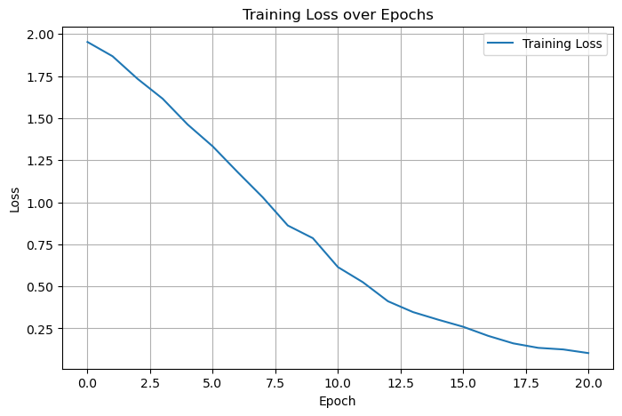
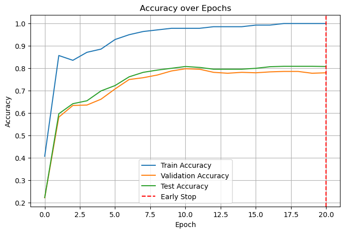
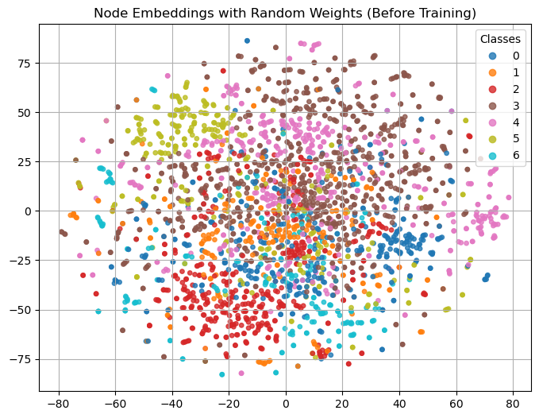

<!DOCTYPE html>
<html lang="en">
<head>
  <meta charset="UTF-8" />
  <meta name="viewport" content="width=device-width, initial-scale=1.0"/>
  <title>GCN on Cora - Project Report</title>
  
</head>
<body>

  

    <a class="arxiv-button" href="https://arxiv.org/abs/1609.02907" target="_blank">
      📄 View Original GCN Paper on arXiv
    </a>
  

  

    <h1>Graph Convolutional Networks (GCNs) on Cora Dataset</h1>
    

      This project implements and trains a two-layer Graph Convolutional Network (GCN) for semi-supervised node classification on the Cora citation network dataset. The core idea is to leverage the graph structure and node features to learn expressive embeddings that generalize well to unseen nodes, even with very limited labeled data.
    

  

  

    <h2>Overview and Motivation</h2>
    

      Traditional neural networks don't take into account the relational inductive bias inherent in graph-structured data. GCNs solve this by aggregating features from a node's neighbors during learning, allowing the network to propagate label information through the graph. In the Cora dataset, each node represents a paper, and edges represent citations. The task is to classify each paper into one of several categories using a small set of labeled nodes.
    

    

      This implementation includes a clean architecture, early stopping, loss tracking, and clear visualization of both training metrics and learned embeddings. The model was trained for up to 200 epochs with patience set to 10.
    

  

  

    <h2>Training Results</h2>
    

      Achieved the following performance on the Cora dataset:
    

    <ul>
      <li><strong>Training Accuracy:</strong> 100%</li>
      <li><strong>Validation Accuracy (Best):</strong> 79.80%</li>
      <li><strong>Test Accuracy at Best Val:</strong> 80.80%</li>
    </ul>
  

  

    <h2>Loss & Accuracy Curves</h2>
    

      

        <h3>Training Loss</h3>
        
      

      

        <h3>Accuracy</h3>
        
      

    

  

  

    <h2>Node Embeddings</h2>
    

      Below, we visualize the learned 2D embeddings using t-SNE. Left shows embeddings from a randomly initialized model (before training). Right shows the same network after training. Clear class separation emerges once the model has been optimized.
    

    

      

        <h3>Before Training (Random Weights)</h3>
        
      

      

        <h3>After Training (GCN Embeddings)</h3>
        
      

    

  

  

    <h2>Conclusion</h2>
    

      This project demonstrates that even with a simple two-layer GCN, it's possible to achieve strong performance on the semi-supervised node classification task. The network successfully propagates label information through graph neighborhoods and learns embeddings that are linearly separable. Visualization of embeddings highlights the effectiveness of GCN's message-passing paradigm.
    

  

  

    <h2>Reference</h2>
    <blockquote>
      Kipf, T.N. and Welling, M., 2016. Semi-supervised classification with graph convolutional networks. <i>arXiv preprint arXiv:1609.02907</i>.
    </blockquote>
  

</body>
</html>
